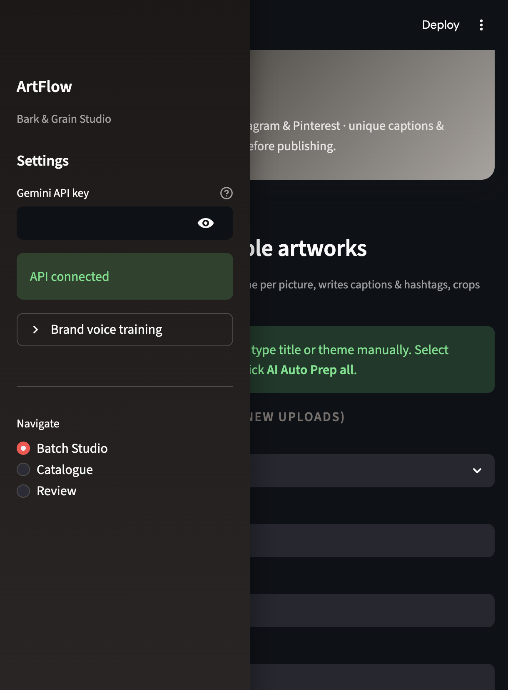

# ArtFlow AI

[](https://artflow-bark-grain.streamlit.app/)
[](https://www.python.org/)
[](https://streamlit.io/)
[](https://ai.google.dev/)
[](LICENSE)

**Live app:** [https://artflow-bark-grain.streamlit.app](https://artflow-bark-grain.streamlit.app/)

**Multimodal AI publishing assistant for independent artists** — built for real SME workflows (Bark & Grain Studio, Bristol).

**MSc AI @ UWE Bristol** · Hackathon delivery for [Roxy Megyesi](https://www.roxymegyesi.com/) · Bark & Grain Studio

Upload artwork → AI analyses each image → generates **title, theme, platform captions, hashtags, and cropped assets** for Instagram, Pinterest, Squarespace, Gelato, and web — with **human approval** before anything goes live.

> **Client context:** Developed during a UWE Bristol hackathon for [Roxy Megyesi](https://www.roxymegyesi.com/) · Bark & Grain Studio.  
> **Positioning:** Marketing prep assistant — not auto-posting, not altering master artwork files.

---

## Demo

### Batch Studio dashboard



*Batch Studio: upload multiple pieces, select platforms, run **AI Auto Prep all** for per-image titles, captions, hashtags, and exports.*

<p align="center">
  
</p>

*Settings, Gemini integration, brand-voice examples (few-shot), and catalogue/review navigation.*

---

## Problem

Solo artists spend **20–40 minutes per piece** on repetitive publishing work:

- Resizing and cropping for Instagram, Pinterest, shop, and print-on-demand  
- Writing on-brand captions and hashtags  
- Creating website and Gelato listings  

When that stalls, artwork stays unpublished and visibility drops. ArtFlow automates **preparation** while keeping the artist in control of what gets published.

---

## Solution

| Step | What ArtFlow does |
|------|-------------------|
| **Upload** | One or many JPG/PNG files; masters saved read-only in `uploads/` |
| **Analyse** | Gemini vision suggests **title, theme, collection** from each image |
| **Generate** | Unique Instagram/Pinterest/shop copy + hashtags per artwork |
| **Export** | Platform crops: IG square/portrait, Pinterest vertical, website, Gelato |
| **Approve** | Approve · Revise · Reject — catalogue tracks status |

**Not included (by design):** auto-posting to social accounts, modifying Dropbox masters, clinical-style “set and forget” automation.

---

## Key features

- **AI Auto Prep** — one click: analyse image → metadata → captions → all platform crops  
- **Batch Studio** — process multiple artworks in one run  
- **Brand voice** — website scrape ([roxymegyesi.com](https://www.roxymegyesi.com/)) + optional example captions/hashtags  
- **Per-platform copy** — Instagram vs Pinterest vs Gelato (different tone/length)  
- **Crop preview** — preview framing before writing files  
- **SQLite catalogue** — draft → pending review → approved / needs revision / rejected  
- **Structured outputs** — `content.json`, `platform_checklist.json`, resized JPGs per platform  
- **Fallback mode** — runs without API key (generic copy; crops still work)

---

## Tech stack

| Layer | Technology |
|--------|------------|
| App | Streamlit |
| Vision + language | Google Gemini 2.0 Flash |
| Images | Pillow (PIL) |
| Brand context | BeautifulSoup + Requests |
| Data | SQLite (`artflow.db`) |
| Language | Python 3.10+ |

---

## Architecture

```text
Upload (1..N images)
        │
        ▼
┌───────────────────┐     ┌────────────────────┐
│  Image Processor  │     │  Publishing Agent   │
│  crop / resize    │     │  scrape website     │
│  platform sizes   │     │  Gemini multimodal  │
└─────────┬─────────┘     └──────────┬─────────┘
          │                            │
          └────────────┬───────────────┘
                       ▼
              Output pack per artwork
         (content.json + crops + checklist)
                       │
                       ▼
              Human approval workflow
                       │
                       ▼
              Manual publish (IG, Pinterest, shop)
```

### Agents

**1. Image Processing Agent** — centre-crop and resize to:

| Asset | Size |
|--------|------|
| Instagram square | 1080 × 1080 |
| Instagram portrait | 1080 × 1350 |
| Pinterest vertical | 1000 × 1500 |
| Website thumbnail | 1200 × 800 |
| Website product | 1600 × 1200 |
| Gelato print | 2400 × 3000 |

**2. Publishing Agent** — combines artwork image + website text + brand profile + optional revision notes → JSON content pack.

---

## Example outputs

Each run creates a folder under `outputs/{artwork}_{timestamp}/`:

```text
content.json              # titles, captions, hashtags, Gelato fields
generated_content.txt     # human-readable copy
platform_checklist.json   # per-platform posting checklist
instagram_square.jpg
instagram_portrait.jpg
pinterest_vertical.jpg
website_thumbnail.jpg
website_product.jpg
gelato_print.jpg            # when Gelato selected
```

**Sample fields in `content.json`:** `suggested_title`, `suggested_theme`, `instagram_caption`, `pinterest_description`, `hashtags`, `gelato_product_description`, …

---

## Human-in-the-loop

ArtFlow is intentionally **not** a fully autonomous publisher:

- Creators **approve** copy and crops before use  
- **Revise** sends notes back into the next Gemini generation  
- Master files in `uploads/` are **never** overwritten by the app  
- Supports authentic brand voice (hand-made art, not generic influencer tone)

---

## Quick start

```bash
git clone https://github.com/Kushs22/ai-artwork-publishing-system.git
cd ai-artwork-publishing-system

python3 -m venv .venv
source .venv/bin/activate
pip install -r requirements.txt
```

**API key** — [Google AI Studio](https://aistudio.google.com/app/apikey)

```bash
# Option A: environment
export GEMINI_API_KEY="your-key"

# Option B: Streamlit secrets (recommended)
mkdir -p .streamlit
# Add GEMINI_API_KEY to .streamlit/secrets.toml
```

**Run locally**

```bash
streamlit run app.py --server.port 8502
```

Open **http://localhost:8502** → **Batch Studio** → upload images → **AI Auto Prep all**.

Detailed setup: [SETUP.md](SETUP.md) · Privacy (UK): [PRIVACY.md](PRIVACY.md)

---

## Live deployment

**Production demo:** [artflow-bark-grain.streamlit.app](https://artflow-bark-grain.streamlit.app)

Hosted on Streamlit Community Cloud. Add `GEMINI_API_KEY` in app **Settings → Secrets** on [share.streamlit.io](https://share.streamlit.io).

To redeploy after code changes: push to `main` → Streamlit rebuilds automatically.

---

## Project structure

```text
ai-artwork-publishing-system/
├── app.py                 # Streamlit UI (Batch Studio, Catalogue, Review)
├── publishing_agent.py    # Gemini + website context + content packs
├── image_processor.py     # Platform crops
├── batch_processor.py     # Multi-image processing
├── brand_voice.py         # Roxy / Bark & Grain brand profile
├── brand_profile/
│   └── roxy_bark_grain.json
├── db.py / approval.py    # Catalogue + workflow
├── metadata_utils.py      # AI → metadata merge
├── export_utils.py        # ZIP download + save to local folder
├── ui_theme.py            # Custom styling
├── images/                # README screenshots
├── SETUP.md
├── ROXY_QUICK_START.md    # Client handout (1 page)
└── PRIVACY.md
```

---

## Sprint / SME alignment

Built against a **Bark & Grain Studio** publishing brief:

| Requirement | Status |
|---------------|--------|
| Upload / monitor artwork | Upload + batch (folder watch: roadmap) |
| Platform captions, hashtags | Per image, per platform |
| Crop / size requirements | All major platforms |
| Website / POD listing draft | Squarespace + Gelato in `content.json` |
| Catalogue + approval | SQLite + Approve/Revise/Reject |
| No auto-post / no master harm | Enforced |

---

## Roadmap

- [ ] Dropbox folder watch (read-only ingest)  
- [ ] Posting schedule export (CSV / calendar)  
- [ ] Streamlit Cloud password gate for client demos  
- [ ] Optional social APIs (with explicit consent)  

---

## Author

**Kush Sharma** — MSc AI, UWE Bristol · BEng Electrical Engineering, Thapar University

- **GitHub:** [Kushs22/ai-artwork-publishing-system](https://github.com/Kushs22/ai-artwork-publishing-system)
- **Live demo:** [artflow-bark-grain.streamlit.app](https://artflow-bark-grain.streamlit.app)
- **Client:** [roxymegyesi.com](https://www.roxymegyesi.com/)

**Portfolio narrative:** Hackathon → Bristol SME → multimodal AI workflow with responsible human-in-the-loop design.

---

## Disclaimer

Educational and decision-support prototype. Not clinically or commercially validated for third-party deployment without review. Artists must verify all copy and crops before publishing.
